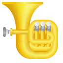

<p align="center">
  
</p>
<h1 align="center">Tuba</h1>
<h3 align="center">Browse the Fediverse</h3>
<p align="center">
  <br />
    <a href="./CODE_OF_CONDUCT.md"></a>
    <a href="./LICENSE"></a>
    <a href="https://github.com/GeopJr/Tuba/actions/workflows/build.yml"></a>
    <a href='https://stopthemingmy.app'></a>
</p>

<p align="center">
    
</p>

# Install

## Official

### Release

<a href="https://flathub.org/apps/details/dev.geopjr.Tuba" rel="noreferrer noopener" target="_blank"></a>

### Nightly

Flatpak | Snap
:---: | :---:
[x86_64](https://nightly.link/GeopJr/Tuba/workflows/build/main/dev.geopjr.Tuba.Devel-x86_64.zip) | [x86_64](https://nightly.link/GeopJr/Tuba/workflows/build/main/snap-x86_64.zip)
[aarch64](https://nightly.link/GeopJr/Tuba/workflows/build/main/dev.geopjr.Tuba.Devel-aarch64.zip) | [aarch64](https://nightly.link/GeopJr/Tuba/workflows/build/main/snap-aarch64.zip)

## Third Party

[](https://repology.org/project/tuba/versions)

## From Source

<details>
<summary>Dependencies</summary>

Package Name | Required Version
:--- |---:|
meson | 0.56
valac | 0.48
libjson-glib-dev | 1.4.4
libxml2-dev | 2.9.10
libgee-0.8-dev | 0.8.5
libsoup3.0-dev | 3.0.0
libadwaita-1.0-dev | 1.5
libsecret-1-dev | 0.20

</details>

### Makefile

```
$ make
$ make install
```

### GNOME Builder

- Clone
- Open in GNOME Builder

# Sponsors

<div align="center">

[](https://github.com/sponsors/GeopJr)

</div>

# Acknowledgements

- Tuba is a fork of [Tootle](https://github.com/bleakgrey/tootle) by [Bleak Grey](https://github.com/bleakgrey)
- Translations are managed by [Weblate](https://hosted.weblate.org/engage/tuba/)
- Design inspiration taken from [Mastodon](https://github.com/mastodon/) & [Elk](https://github.com/elk-zone/elk)

[](https://hosted.weblate.org/engage/tuba/)

# Contributing

1. Read the [Code of Conduct](./CODE_OF_CONDUCT.md)
2. Fork it ( https://github.com/GeopJr/Tuba/fork )
3. Create your feature branch (git checkout -b my-new-feature)
4. Commit your changes (git commit -am 'Add some feature')
5. Push to the branch (git push origin my-new-feature)
6. Create a new Pull Request
